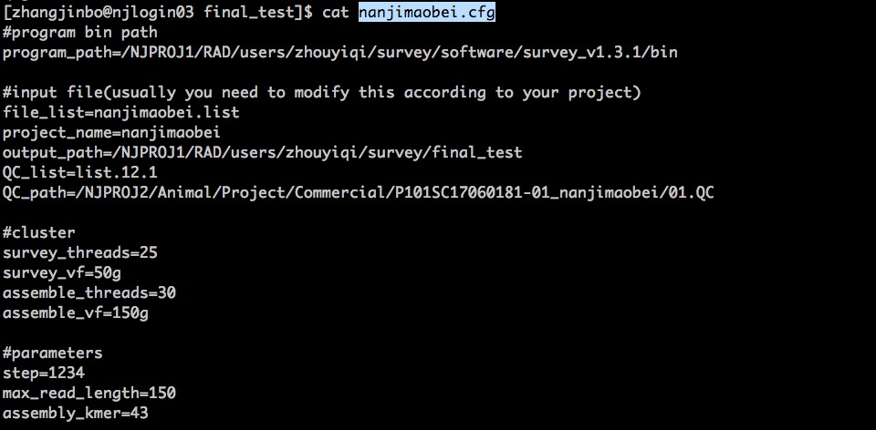
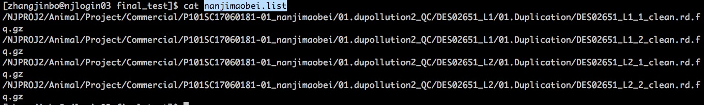

.. _ConfigandUsage:

Config and Usage
================================================================================

.. _PrepareConfig:

Prepare Config file
--------------------------------------------------------------------------------

First, you have to prepare a 'example.cfg', which contains the informations survey requires to fish all the tasks.**You can just copy the 'example.cfg' from the survey folder and alter the necessary items just as following:**

An example of the config.cfg was stored in the cluster:

   > /NJPROJ1/RAD/users/zhouyiqi/survey/final_test/nanjimaobei.cfg

Here, in the config.cfg, the reads.list store all the paths for the long reads files, for example:

For more information about the parameters in config.cfg, you can refer to the part *Parameters* 
under the section *Overview*.

.. _Usage:

Usage
--------------------------------------------------------------------------------

It is very easy to use run_pbjelly, just as the following commands:

   > /ifs/TJPROJ3/RAD/zhouyiqi/tar/survey_v1.3/bin/survey.sh example.cfg

Here comes a tested example:

   > /NJPROJ1/RAD/users/zhouyiqi/survey/final_test

After this, it will generate all the dirs and shells and qsub all the shells for you.

