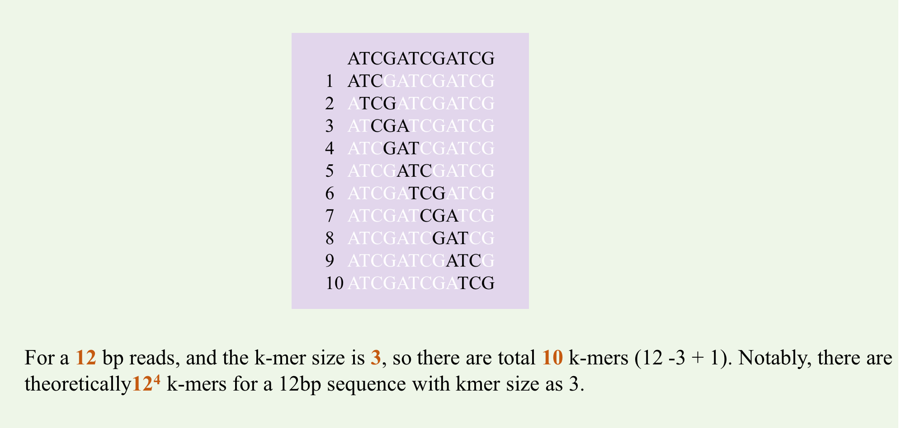

Overview
================================================================================

Scope
--------------------------------------------------------------------------------

The survey package can be applied to the illumina short reads or other sequencing reads with high accuracy. There are no requirements of the mate-pair reads(with large insert size > 1kbp). While it is not suitable for the PacBio or ONT long reads, given the the relatively high error rates(~15%) of such technologies.

introduction
--------------------------------------------------------------------------------

The term **k-mer** typically refers to all the possible substrings of length k that are contained in a string. In genomics, k-mers refer to all the possible subsequences (of length k) from a read obtained through DNA sequencing. The amount of k-mers possible given a string length **L** is **L-k+1**, whilst the number of possible k-mers given 4(in the case of ATCG) possiblities is 4**k. Usually, the k-mer size is set as 17 for a genome survey, representing the total number of possible k-mers is ~17 G. Next comes a simple illustration of k-mers: 

In *de novo* genome projects, analyzing the k-mer frequency, which is **independent** of genome assembly, is widely used as an alternative way to estimate the genome size. The "ideal" sequencing data is assumed to be produced from randomly single-ended and equal-length whole genome shotgun process without any sequencing errors or coverage bias, such data meaning that distribution for the start positions of reads follows a Poisson distribution. Also, because the read lenght (L) is far shorter than the genome size (L<<G), the k-mers can be thought to be generated by random processes and their coverage depth will also follow Poisson distribution. Based on Poisson theory as well as the relationship between base number and k-mer number, the sequencing depth(expected base coverage depth) and genome size can be calculated by formulas (1) and (2):

			**Coverage(base)** = coverage(k-mers) * L / (L-K+1)			(1)

			**Genome size** = number of k-mers/coverage(k-mers)			(2)

Here comes an exmple of k-mer analysis fo our Gnetum genome project. K-mer distributions generated by spliting reads into 17-mers, produces two peaks, the peak with the lower coverage is thought to be derived from heterozygous loci and the long tails, these long tails represents the k-mers from the repetitive sequences. And the notably high kmer frequence around 1 or 2 represent k-mers are caused by sequencing errors.

.. _InputOutput:

Input and Output
--------------------------------------------------------------------------------

To run survey package, you have to prepared two files. The first one is 'reads.list' file where each line stores the path for the reads files independently. Besides, you have to prepare a 'example.cfg' file, containing QC path(used for generating Reports), reads.list, output dir and all kinds of parameters.

For more information, you can refer to the part 'Config and Usage' under the section  *Examples* .

.. _Parameters:

Parameters
--------------------------------------------------------------------------------

There are mainly **three steps** in survey, and all the important parameters were saved in the example.cfg file (see more details in the *Example* section). The parameters are shown as followed:

.. csv-table::
   :file: tables/para_summary.tsv
   :delim: tab
   :header-rows: 1
   :widths: 15, 10, 75

