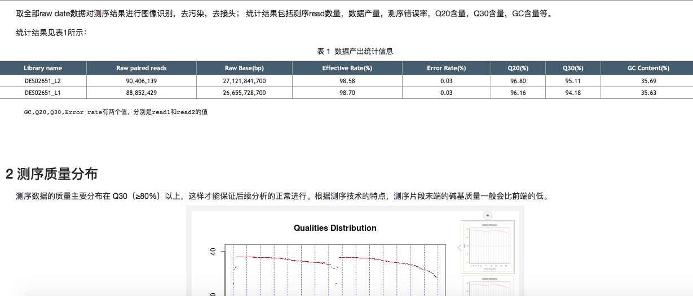
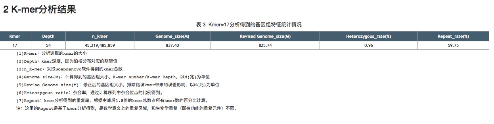
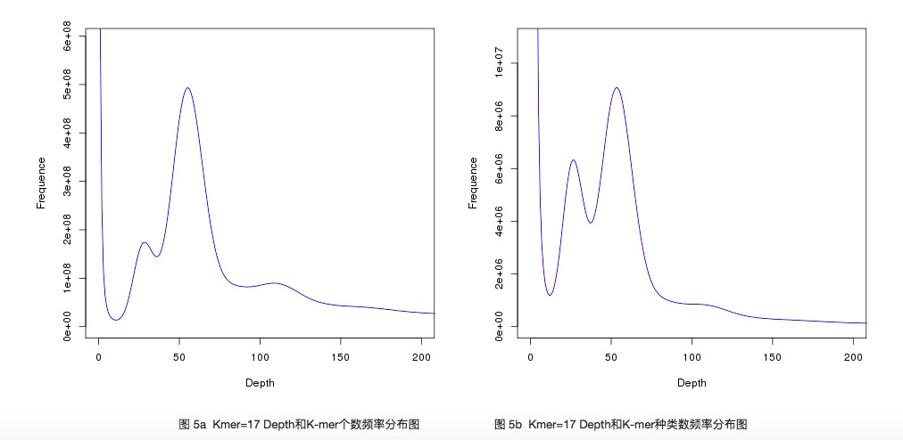
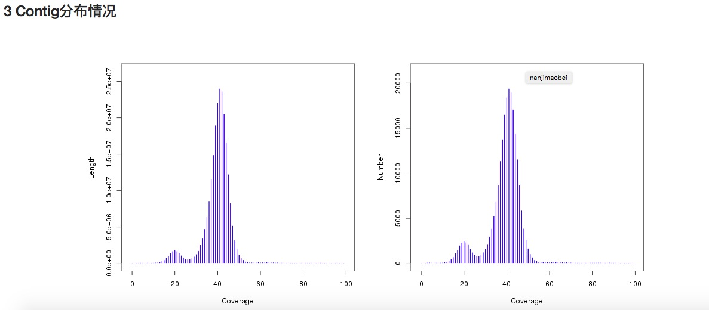
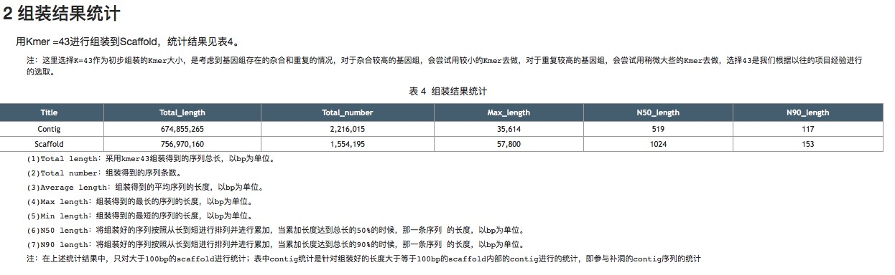
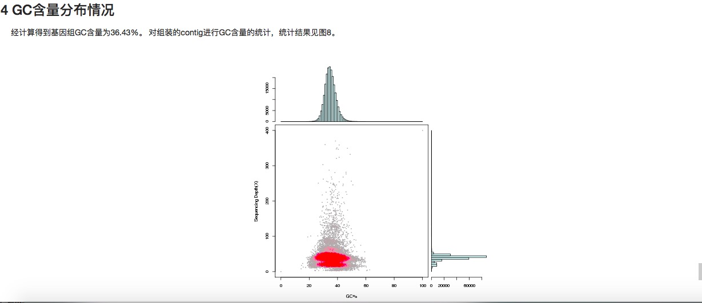

Results
================================================================================

folders
--------------------------------------------------------------------------------

Basically, there are 4 folders, including **01Survey**, **02Assemble**, **03Coverage_contig**, and **\*.Survey.report**.
Their introduction is as following tables(same as the table in **Storage** section, 850 genome with 50x data):

.. csv-table::
   :file: tables/storage.tsv
   :delim: tab
   :header-rows: 1
   :widths: 15, 10, 75

k-mer frequnce file
--------------------------------------------------------------------------------

After counting k-mers, survey output all the k-mers frequence in the file named '*.17merFreq' under the file folder '01Survey'. There are two figures for k-mers 'number' curve  and k-mers 'species' curve. Usually, 
the value of 'num' = the value of 'spe' * coresponding k-mers depth.

Assemble sequences
--------------------------------------------------------------------------------

Besides, SOAPdenovo output the contig file named '*.contig' and the scaffolds file name '*.scafSeq' under the file folder '02Assemble'.

And the **coverge vs length** curve, **coverage vs GC** content curve were generated under the file folder '03Coverage_contig'.

.. _Reports:

Reports
--------------------------------------------------------------------------------

We also generated a html report for run_pbjelly, which include QC statistics, k-mer analysis, and assembly information, et al:

(a)

(b)

(c)

(d)

(e)

(f)

(g)

